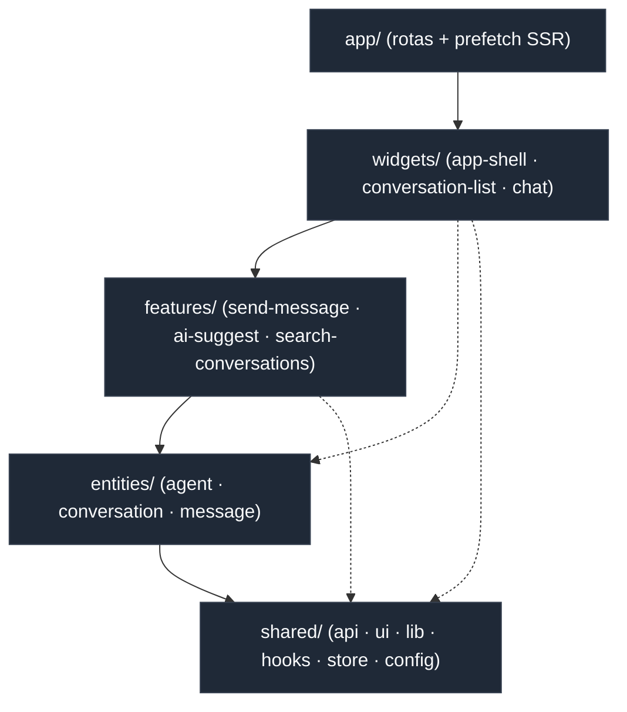
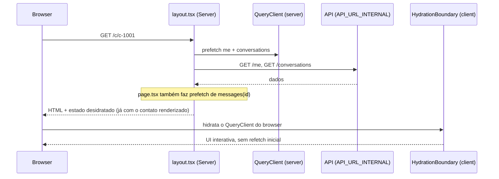
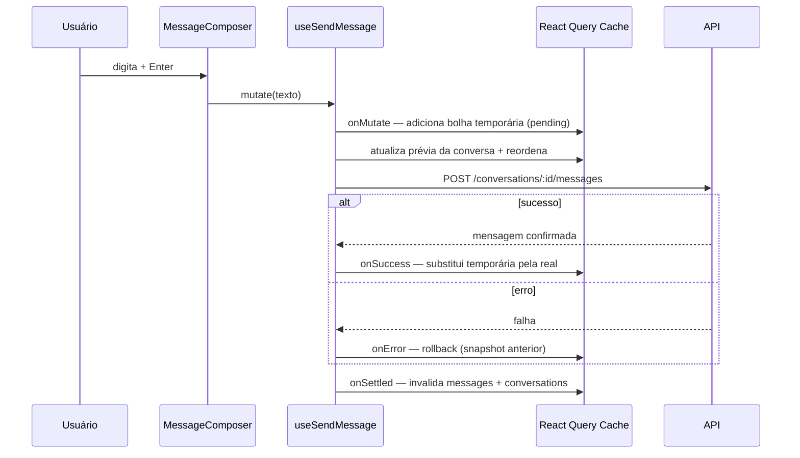
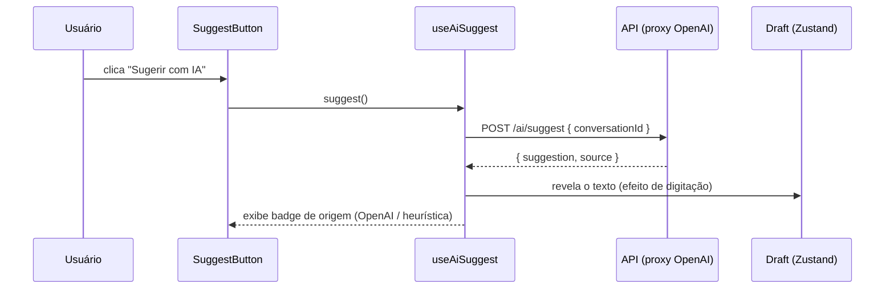
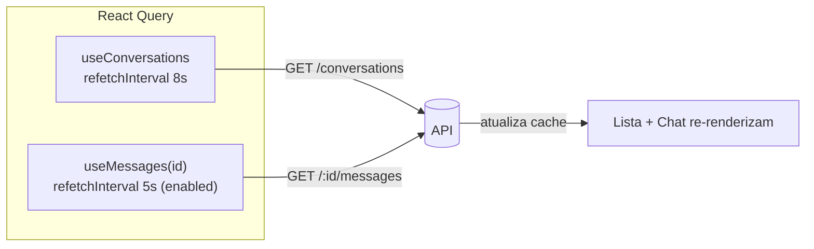
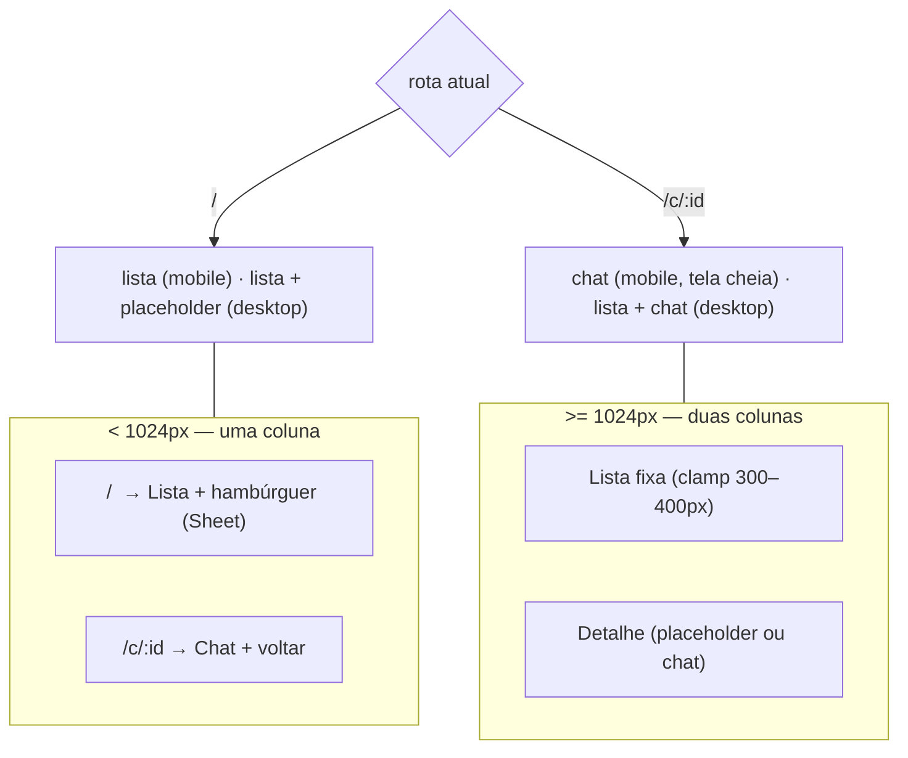
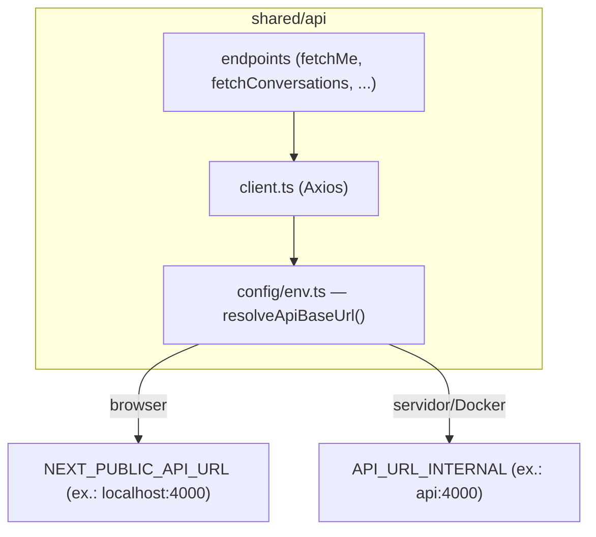

# Fluxos do Projeto — Inbox de Atendimento

Documentação dos fluxos principais (arquitetura, dados e UX). Os diagramas usam **Mermaid**
(renderizam direto no GitHub). Para o "como rodar" e as decisões resumidas, veja o
[`README.md`](../README.md).

---

## 1. Arquitetura FSD — direção das dependências

Cada camada só pode importar das camadas **abaixo** dela. Isso elimina dependências circulares
e mantém `entities`/`features` reutilizáveis e testáveis.

| Camada | Responsabilidade | Exemplos |
|--------|------------------|----------|
| `app` | Roteamento fino + prefetch SSR | `layout.tsx`, `c/[id]/page.tsx` |
| `widgets` | Composição de tela | `app-shell`, `conversation-list`, `chat` |
| `features` | Casos de uso com interação | envio otimista, sugestão de IA, busca |
| `entities` | Modelo de domínio + UI "burra" | `agent`, `conversation`, `message` |
| `shared` | Base reutilizável | cliente Axios, shadcn/ui, utilitários |

---

## 2. Boot da aplicação — SSR + hidratação (sem waterfall)

A primeira pintura já chega com dados: o **Server Component** faz o prefetch e desidrata o cache
do React Query; o cliente hidrata sem refazer as buscas.

> Verificado: `curl http://localhost:3000/c/c-1001` retorna o HTML já contendo o nome do contato.

---

## 3. Envio de mensagem — update otimista

A bolha aparece **imediatamente** (status "enviando"); em erro há rollback, e a resposta do
servidor substitui a mensagem temporária. Código: `features/send-message/use-send-message.ts`.

---

## 4. Sugestão de IA — `/ai/suggest`

O botão chama o backend (que faz o proxy da OpenAI — a chave nunca chega ao browser) e a sugestão
é "digitada" no campo com um efeito leve de revelação. Código: `features/ai-suggest/use-ai-suggest.ts`.

---

## 5. Atualização ao vivo — polling do React Query

> Decisão: o backend fornecido expõe apenas REST; polling é suficiente e robusto. Evolução possível:
> SSE via *route handler* BFF (a flag `failed` no modelo de mensagem já prepara o reenvio).

---

## 6. Roteamento responsivo — master-detail

Uma rota define o que aparece; o CSS define a visibilidade por breakpoint. Código:
`widgets/app-shell/ui/app-shell.tsx`.

Validado de **280px (Galaxy Z Fold)** ao desktop: sem overflow horizontal, `truncate` em nomes/mensagens
e alvos de toque adequados.

---

## 7. Camada de dados — um cliente, base URL por runtime

Resolve o clássico problema de URL dupla em SSR dentro de containers: o navegador e o servidor
alcançam a API por caminhos diferentes, mas pelo mesmo código.
